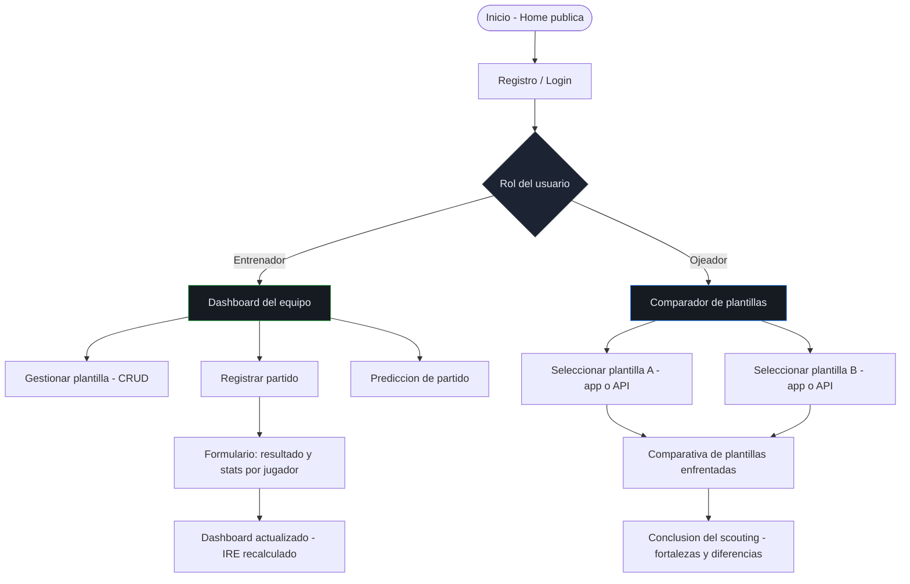

# DIW-Recuperacion-RA1

Documentación de diseño para **CoachLab Fútbol**, una aplicación enfocada en el análisis, la gestión de equipos y la comparación de plantillas dentro de un contexto claramente deportivo. La propuesta se construye alrededor de dos perfiles de uso distintos, entrenador y ojeador, porque cada uno necesita consultar la información de una forma diferente.

## Accesos del proyecto

| Recurso | Enlace |
| --- | --- |
| Archivo de diseño en Figma | [CoachLab Fútbol — Figma](https://www.figma.com/design/FeN911SYahBJ4NLjlpGhRW/CoachLab-F%C3%BAtbol--Planifica--Entrena-y-Mejora-con-Datos-Reales?node-id=0-1) |
| Diagrama de flujo de usuario | [CoachLab — User Flow](https://www.figma.com/board/DLZRrX6mhiPoSXNKVjj5ON/CoachLab-%E2%80%94-User-Flow?node-id=0-1) |

---

## 1. Idea del producto

CoachLab no se plantea como una app para consultar resultados sueltos, sino como una herramienta de apoyo a la toma de decisiones. Por eso el proyecto da tanto peso al análisis visual, a los indicadores de rendimiento y a la comparación entre jugadores o plantillas.

La aplicación se divide en dos recorridos principales:
- **Entrenador**, que trabaja sobre su propio equipo.
- **Ojeador**, que necesita comparar conjuntos de jugadores y extraer conclusiones.

Separar estos dos perfiles mejora la claridad de uso. El entrenador necesita continuidad sobre sus propios datos, mientras que el ojeador necesita rapidez para observar, contrastar y detectar diferencias.

---

## 2. Dirección visual

La identidad visual de CoachLab parte de una idea simple: el producto debe sentirse deportivo, analítico y profesional al mismo tiempo. No interesa transmitir un tono de entretenimiento, sino de herramienta útil para observar rendimiento y tomar decisiones con criterio.

> **Pendiente:** añadir `img/principios/moodboard.png` con referencias visuales centradas en análisis deportivo, cuadros de mando, césped, táctica y seguimiento de rendimiento.

### Qué debe transmitir la interfaz

- **Rigor**, porque la app gira en torno a datos, estadísticas e interpretación.
- **Contexto futbolístico**, para que la temática se entienda de forma inmediata.
- **Evolución y mejora**, ya que el objetivo del producto es medir progreso.
- **Doble lectura del juego**, una desde la gestión del equipo y otra desde la observación comparativa.
- **Seriedad profesional**, evitando una estética recargada o demasiado lúdica.

Esta intención general justifica que muchas decisiones visuales sean sobrias. Si la interfaz estuviera llena de colores agresivos, adornos o contrastes innecesarios, perdería credibilidad como herramienta de análisis.

---

## 3. Sistema de color

CoachLab utiliza una base oscura con acento verde. La elección no es decorativa, sino funcional y semántica.

### 3.1 Verde como color principal

| Token | Valor | Uso |
| --- | --- | --- |
| `--color-accent` | `#2ea043` | Acción principal, resaltados, marca |
| `--color-accent-hover` | `#3fb950` | Estado hover |
| `--color-accent-muted` | `rgba(46,160,67,0.15)` | Fondos de acento, badges |

El verde conecta directamente con el césped y, por tanto, con el universo del fútbol. Además, es un color que culturalmente se asocia a avance, acierto y resultado positivo, así que funciona bien para CTAs, estados correctos y elementos de marca.

Reservar ese color para acciones importantes también ayuda a jerarquizar. Si todo tuviera el mismo nivel de color, la interfaz perdería foco; al limitar el verde a puntos clave, se guía la atención del usuario hacia lo importante.

### 3.2 Fondos y superficies

| Token | Valor | Uso |
| --- | --- | --- |
| `--color-bg` | `#0d1117` | Fondo de página |
| `--color-surface` | `#161b22` | Tarjetas y paneles |
| `--color-surface-2` | `#1c2333` | Superficies elevadas, inputs |
| `--color-border` | `#30363d` | Bordes y divisores |
| `--color-text` | `#e6edf3` | Texto principal |
| `--color-text-muted` | `#8b949e` | Texto secundario |
| `--color-text-faint` | `#484f58` | Placeholder / deshabilitado |

El uso de un tema oscuro responde a dos motivos. El primero es visual: hace que tarjetas, métricas, gráficos y badges resalten más. El segundo es contextual: una app de análisis deportivo encaja bien con una estética de dashboard, donde el contenido principal son datos, comparativas y estados.

También ayuda a separar niveles de información. Fondo, superficie e inputs tienen suficiente diferencia para construir jerarquía visual sin necesidad de abusar del color.

### 3.3 Colores semánticos

| Estado | Token | Valor | Significado |
| --- | --- | --- | --- |
| Victoria | `--color-success` | `#2ea043` | Resultado positivo |
| Empate | `--color-warning` | `#d29922` | Resultado neutro |
| Derrota | `--color-danger` | `#f85149` | Resultado negativo |
| Información | `--color-info` | `#388bfd` | Datos neutros o enlaces |

Aquí se aplica una codificación muy reconocible: verde, ámbar y rojo. La ventaja es que el usuario no necesita aprender una lógica nueva para interpretar el estado de un partido o una métrica rápida.

Además, usar estos colores solo en badges, indicadores y estados concretos evita que la interfaz se vuelva caótica. El color queda al servicio del significado, no del adorno.

---

## 4. Sistema tipográfico

La tipografía se plantea con una combinación de **serif para títulos** y **sans-serif para cuerpo e interfaz**. La decisión responde tanto al criterio académico del ejercicio como a una lógica real de jerarquía visual.

| Rol | Familia | Token | Clasificación |
| --- | --- | --- | --- |
| Títulos y titulares | **Fraunces** | `--font-display` | Serif |
| Cuerpo, datos, KPIs y UI | **Inter** | `--font-body` | Sans-serif |

### 4.1 Por qué Fraunces en títulos

Fraunces aporta personalidad y autoridad visual. Usarla solo en encabezados permite que los títulos tengan presencia propia sin contaminar el resto de la interfaz.

Esta decisión ayuda a distinguir de manera inmediata entre bloques estructurales y contenido operativo. El usuario identifica el título como punto de entrada visual y deja el peso funcional de la lectura en una tipografía más neutra.

### 4.2 Por qué Inter en cuerpo y datos

Inter funciona mejor en entornos de lectura de pantalla con mucha densidad de información. En una app con formularios, estadísticas, tablas, tarjetas y valores numéricos, una sans-serif clara y neutra reduce ruido y mejora legibilidad.

También es una buena elección para KPIs, IRE y cifras de resumen, porque esos datos necesitan precisión visual más que personalidad expresiva. En ese contexto, la claridad importa más que el estilo.

### 4.3 Escala tipográfica

| Token | Tamaño | Peso | Uso |
| --- | --- | --- | --- |
| `--text-xs` | 0.75rem | 400 | Captions, badges |
| `--text-sm` | 0.875rem | 400 | Etiquetas secundarias |
| `--text-base` | 1rem | 400 | Cuerpo |
| `--text-lg` | 1.125rem | 600 | Subtítulos *(Fraunces)* |
| `--text-xl` | 1.25rem | 600 | Títulos de sección *(Fraunces)* |
| `--text-2xl` | 1.5rem | 700 | Títulos de página *(Fraunces)* |
| `--text-3xl` | 1.875rem | 700 | Valores KPI *(Inter)* |
| `--text-4xl` | 2.25rem | 800 | Titulares hero *(Fraunces)* |

La escala se apoya en una base de 8 px para mantener coherencia con el espaciado. Esto facilita que tamaño, ritmo vertical y composición trabajen sobre una misma lógica modular.

---

## 5. Arquitectura de uso

La estructura de la aplicación se organiza por roles. Esta decisión no solo responde a la funcionalidad, sino también a la claridad del producto.

### 5.1 Rol de entrenador

El entrenador necesita una visión continua de su propio equipo. Por eso su pantalla principal es un dashboard con acceso a plantilla, registro de partido, KPIs, racha e IRE.

Su recorrido principal es este:

1. Login.
2. Acceso al dashboard.
3. Registro de partido con resultado y estadísticas por jugador.
4. Actualización del rendimiento del equipo.

Este flujo está pensado para que la consecuencia de una acción sea visible enseguida. Registrar un partido debe traducirse en un cambio perceptible en el panel, porque eso refuerza la utilidad de la herramienta.

### 5.2 Rol de ojeador

El ojeador trabaja con otra lógica. No necesita gestionar un equipo propio, sino observar y comparar perfiles.

Su recorrido principal es este:

1. Login.
2. Selección de plantilla A.
3. Selección de plantilla B.
4. Comparativa y lectura final.

La decisión de separar este flujo del entrenador evita mezclar tareas incompatibles en una misma interfaz. Si ambos recorridos convivieran sin separación clara, el producto perdería foco y sería más difícil de entender.

### 5.3 Flujo general

---

## 6. Decisiones de interfaz

Más allá de color y tipografía, hay varias decisiones que sostienen la propuesta de interfaz.

### 6.1 El dashboard como centro del entrenador

Se prioriza el dashboard porque reúne la información que más valor aporta al entrenador: estado actual, evolución y consecuencias de los últimos partidos. Colocar ahí el IRE, la racha y los KPIs permite una lectura rápida antes de pasar a tareas más concretas.

### 6.2 El IRE como dato principal

El IRE actúa como indicador resumen. Darle protagonismo visual tiene sentido porque condensa el rendimiento en un solo valor y facilita que el usuario entienda rápidamente si la evolución del equipo es positiva o negativa.

### 6.3 Comparación directa para el ojeador

La comparativa entre dos plantillas se plantea como acción principal del ojeador porque responde mejor a su objetivo real. No se trata de navegar por datos aislados, sino de poner dos referencias frente a frente para detectar diferencias y tomar decisiones.

### 6.4 Jerarquía visual por niveles

Cada pantalla debe ordenar su contenido en tres niveles:
- **Primario**, lo que el usuario necesita ver primero.
- **Secundario**, lo que amplía o contextualiza.
- **Terciario**, navegación, acciones auxiliares o elementos de apoyo.

Esta decisión evita pantallas planas donde todo compite por atención. En una app basada en datos, la jerarquía no es un detalle estético: es lo que hace legible la información.

---

## 7. Relación con los criterios de evaluación

Aunque el documento ya no se organiza con el esquema literal de RA1.1, RA1.2 y RA1.3, sí sigue cubriendo los tres criterios desde una estructura más centrada en el producto.

- **Colores y tipografías**, desarrollados y justificados en el sistema visual.
- **User flow**, explicado desde la arquitectura de uso por roles.
- **Prototipado y jerarquía**, trasladados aquí a decisiones de interfaz y organización de pantallas, sin depender de una sección centrada en prompts.

---

## 8. Cierre

CoachLab propone una interfaz deportiva y analítica, con una identidad visual sobria, una jerarquía clara y una separación funcional coherente entre entrenador y ojeador. Las decisiones de color, tipografía, estructura y prioridad de la información no se toman para decorar la aplicación, sino para hacerla más legible, útil y consistente.
